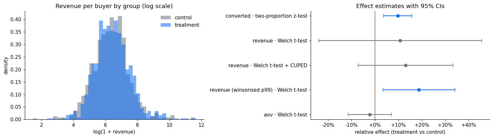
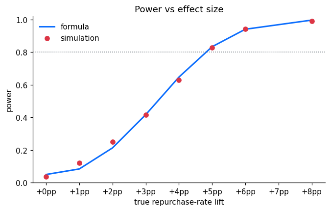

# A/B Test Simulator & Analyser


**Hypothesis design → power analysis → statistical testing → business recommendation**, run end to end on 541,909 real e-commerce transactions.

The [UCI Online Retail](https://archive.ics.uci.edu/dataset/352/online+retail) dataset has no experiment in it, so this project builds one. It randomises real customers into control and treatment, injects a **known** treatment effect, and analyses the result blind. Because the ground truth is known, the project can also prove the statistics work: false-positive rates, power, and how often the final decision is correct.

📓 **[Read the full analysis notebook →](notebooks/ab_test_analysis.ipynb)**

---

## The scenario

> A UK online gift wholesaler wants to know whether a **"We miss you — 10% off your next order"** email brings past customers back.

| | |
|---|---|
| **Unit** | Customer (3,317 who bought in Dec 2010 – Aug 2011) |
| **Test window** | Sep – Nov 2011 (91 days) |
| **Primary metric** | Repurchase rate (baseline 56.4%) |
| **Secondary** | Revenue per eligible customer (CUPED-adjusted) |
| **Guardrail** | Average order value must not drop > 5% |
| **Design** | 50/50 split, α = 0.05 two-sided, 80% power, Holm correction on supporting metrics |

## Headline result

| Metric | Control | Treatment | Effect | 95% CI | p |
|---|---|---|---|---|---|
| Repurchase rate | 56.2% | 61.6% | **+5.5pp** | +2.1 to +8.8pp | 0.001 |
| Revenue / customer (CUPED) | £764 | £847 | +£100 | −£55 to +£255 | 0.21 |
| AOV (guardrail) | £438 | £429 | −2.2% | −11% to +7% | 0.65 |

**Verdict: SHIP.** About 180 extra returning customers per quarter. The revenue gain is directional only (the test wasn't powered for it), so keep a 5–10% holdout post-launch to measure it.

*Ground truth injected: +5.0pp repurchase lift, −3% spend per buyer. Both fall inside the estimated 95% CIs.*



## What the project demonstrates

**Power analysis on a fixed population.** You can't email customers you don't have, so the question becomes: *what can 1,650 customers per arm detect?* Answer: ~4.8pp on repurchase rate, but revenue would need a 49% lift, because the top 1% of customers generate 35% of revenue. That finding is what makes conversion the primary metric.

| Revenue metric | MDE (relative) |
|---|---|
| Raw mean | 49% |
| + CUPED (pre-period revenue, ρ = 0.82) | 28% |
| Winsorised at p99 | 20% |
| Winsorised + CUPED | 13% |

**The power formula matches simulation** on real, messy data:



**A/A tests** confirm ~5% false positives for every test used. **Peeking** 10 times and stopping at the first p < 0.05 inflates the false-positive rate from 4.7% to 20%.

**Decision reliability.** The whole pipeline (randomise → analyse → decide) rerun 150× per scenario:

| True effect | SHIP | DO NOT SHIP | INCONCLUSIVE |
|---|---|---|---|
| None | 4% | 20% | 76% |
| +2pp (below MDE) | 19% | 3% | 77% |
| +5pp, −3% spend | 77% | 5% | 18% |
| +8pp | 99% | 1% | 1% |
| −4pp (harmful) | 0% | 92% | 8% |

It never ships a harmful change, and it correctly says "inconclusive" when an effect is below what the test can detect.

## Statistical toolkit

| Module | Contents |
|---|---|
| `abtest.data` | Download, clean (with an audit funnel), aggregate to a customer-level experiment table |
| `abtest.power` | Sample size, MDE, and power for proportions and means; CUPED-adjusted SD; test duration |
| `abtest.simulate` | Simple and stratified randomisation, effect injection, A/A and power simulations, peeking simulation |
| `abtest.stats` | Two-proportion z-test, chi-square, Welch t-test, Mann-Whitney U, bootstrap, CUPED, winsorisation, SRM check, covariate balance (SMD), Holm/Bonferroni correction |
| `abtest.report` | Pre-registered decision rules, revenue projection, formatted report |

Tested with 19 unit tests (CI coverage, chi² = z², A/A false-positive rate, unbiased effect injection, formulas vs statsmodels) that run in CI on a synthetic fixture, with no dataset download needed.

## Quick start

```bash
git clone https://github.com/zahade/ab-test-simulator.git
cd ab-test-simulator
python -m venv .venv && source .venv/bin/activate
pip install -e ".[dev]"

# run one simulated experiment from the command line
# (downloads the dataset from UCI on first run, ~23 MB)
abtest --conversion-lift 0.05 --revenue-mult -0.03 --seed 20

# try other scenarios
abtest --conversion-lift 0          # no real effect
abtest --conversion-lift -0.04      # harmful change
abtest --stratify pre_revenue       # block-randomise on past spend

# tests and notebook
pytest -q
jupyter lab notebooks/ab_test_analysis.ipynb
```

## Project structure

```
ab-test-simulator/
├── src/abtest/            # the library
├── notebooks/             # full methodology, executed with outputs
├── tests/                 # pytest suite (synthetic data, runs in CI)
├── reports/figures/       # exported charts
└── data/raw/              # dataset lands here (git-ignored)
```

## Limitations

- The treatment effect is **simulated**, not observed. The methodology transfers directly to a live test; the specific numbers don't.
- The effect is homogeneous across customers. Real effects vary by segment.
- 3,317 customers is small by e-commerce standards, which limits revenue conclusions.
- ROI ignores coupon cost and margin.

**Next steps:** sequential testing with alpha spending, Bayesian analysis, a delta-method ratio test for AOV, and heterogeneous treatment effects.

## Data

Chen, D. (2015). *Online Retail* [Dataset]. UCI Machine Learning Repository. https://doi.org/10.24432/C5BW33. Licensed CC BY 4.0.
